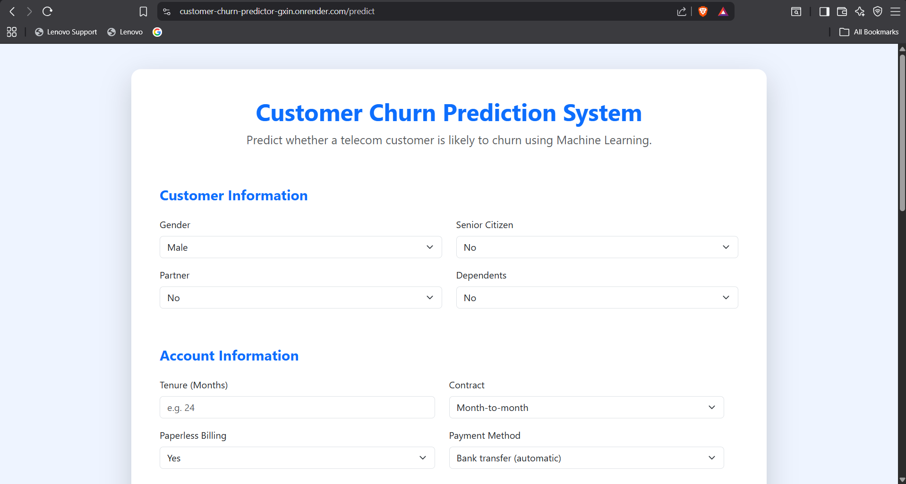
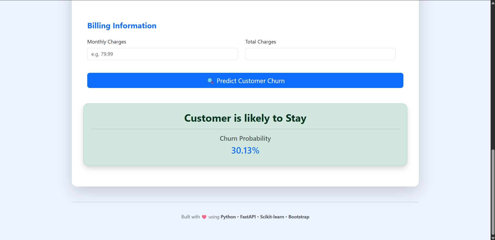
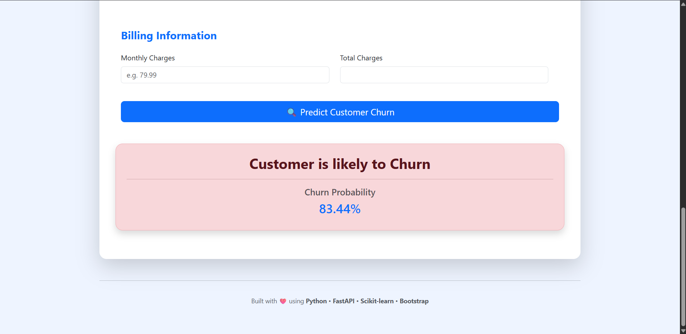

Website link - https://customer-churn-predictor-gxin.onrender.com/
# 🚀 Customer Churn Prediction System

A Machine Learning web application that predicts whether a telecom customer is likely to churn based on customer information.

---

## 📌 Features

- Predicts customer churn using Machine Learning
- Displays probability of churn
- Interactive web interface
- FastAPI backend
- Responsive Bootstrap frontend
- Automatic total charges calculation
- Clean and user-friendly UI

---

## 🛠️ Tech Stack

- Python
- Pandas
- NumPy
- Scikit-learn
- FastAPI
- Jinja2
- Bootstrap 5
- HTML
- Joblib

---

## 📊 Machine Learning Workflow

- Data Cleaning
- Exploratory Data Analysis (EDA)
- One-Hot Encoding
- Train-Test Split
- Feature Scaling
- Logistic Regression
- Decision Tree
- Random Forest
- Model Evaluation
- Model Saving using Joblib

---

## 📁 Project Structure

```
CustomerChurnProject/
│
├── app/
│   ├── main.py
│   ├── predictor.py
│   ├── templates/
│   └── static/
│
├── model/
│   ├── customer_churn_model.pkl
│   ├── scaler.pkl
│   └── model_columns.pkl
│
├── requirements.txt
├── README.md
└── .gitignore
```

---

## ▶️ Installation

Clone the repository

```bash
git clone https://github.com/vinayakparashar01/Customer-Churn-Predictor.git
```

Install dependencies

```bash
pip install -r requirements.txt
```

Run the application

```bash
uvicorn app.main:app --reload
```

Open your browser

```
http://127.0.0.1:8000
```

---

## 📸 Application Screenshots

### 🏠 Home Page



---

### 🟢 Customer is likely to Stay



---

### 🔴 Customer is likely to Churn



---


## 👨‍💻 Author

**Vinayak Parashar**

B.Tech CSE (CSIT)

Ajay Kumar Garg Engineering College
